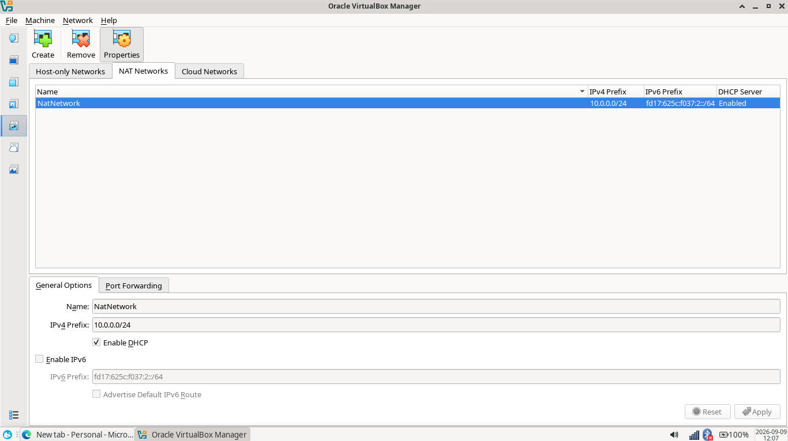
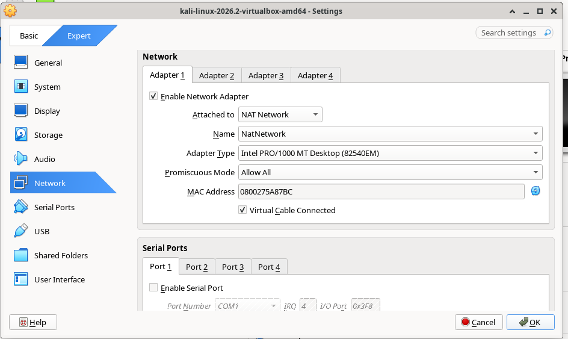
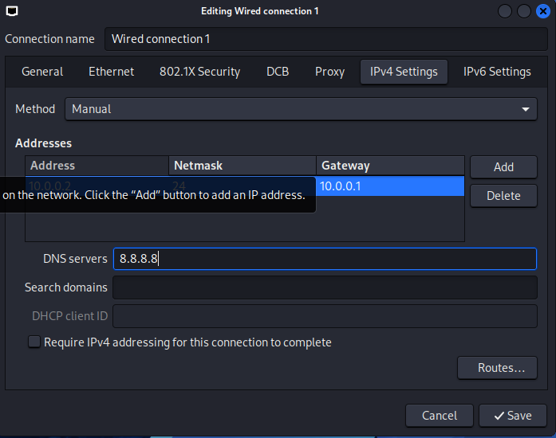
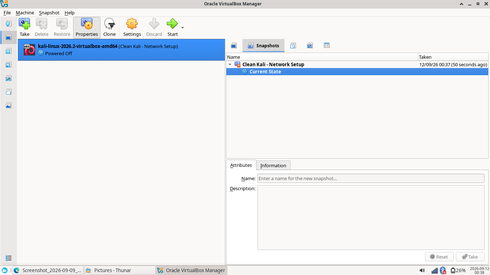
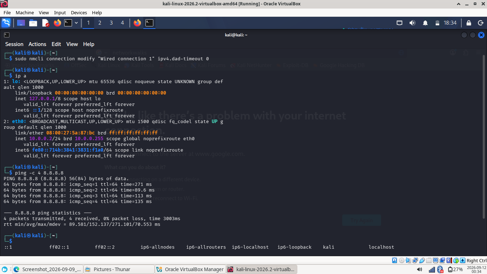

# NETWORKWALKS-B082-WK1-PM1-CYBERSECURITY-LAB-SETUP

**Cybersecurity Lab Environment Setup**
Building an isolated virtual lab for penetration testing and ethical hacking practice

**Project Overview**
This project focuses on setting up a virtual cybersecurity and penetration-testing laboratory using VirtualBox and Kali Linux on CachyOS Linux

The purpose of the lab is to create a controlled environment where cybersecurity tools, network scanning, reconnaissance, vulnerability assessment, and other security-testing activities can be performed safely and repeatedly

The lab is configured on a private virtual network so that additional machines can be added later and used as targets for authorized security testing

**Objectives**
-Install and configure VirtualBox hypervisor on CachyOS.
-Import Kali Linux as a security testing virtual machine.
-Create a private NAT Network for isolated lab communication.
-Assign a static IP configuration to Kali Linux.
-Suppress IPv4 DAD timeouts for persistent network connectivity.
-Verify internal routing, external gateway access, and DNS resolution.
-Create a clean system snapshot baseline for recovery.

**Lab Architecture & Network Specifications**
| Component | Configuration |
| :--- | :--- |
| **Host OS** | CachyOS Linux (XFCE4 Desktop) |
| **Host CPU** | AMD Ryzen 3 7000 Series |
| **Host RAM** | 4 GB |
| **Host Storage** | 256 GB SSD |
| **Hypervisor** | VirtualBox 7.x |
| **Security OS** | Kali Linux |
| **Kali RAM** | 1536 MB |
| **Virtual Network** | NAT Network (`NatNetwork`) |
| **Network Address** | 10.0.0.0/24 |
| **Kali IP Address** | 10.0.0.2/24 |
| **Default Gateway** | 10.0.0.1 |
| **DNS Server** | 8.8.8.8 |
| **Future Target Range** | 10.0.0.3–10.0.0.99 |

**Lab Setup Procedure**

**Step 1. VirtualBox NAT Network Setup**
A custom NAT Network was created in VirtualBox Manager with DHCP enabled to handle lab traffic routing

* **Network Name**: NatNetwork
* **Subnet**: 10.0.0.0/24



**Step 2. Kali Linux VM Network Attachment**
The Kali VM network adapter was attached to the custom NAT Network with promiscuous mode enabled for packet sniffing exercises

* **Attached To**: NAT Network (`NatNetwork`)
* **Adapter Type**: Intel PRO/1000 MT Desktop (82540EM)
* **Promiscuous Mode**: Allow All



**Step 3. Static IPv4 Configuration**
Inside Kali Linux NetworkManager, the primary interface was assigned static parameters:

* **IPv4 Address**: 10.0.0.2
* **Subnet Mask**: 255.255.255.0 (/24)
* **Default Gateway**: 10.0.0.1
* **DNS Server**: 8.8.8.8



Step 4. Baseline Snapshot Creation
After verifying connectivity, a clean baseline snapshot was generated to allow immediate rollback after aggressive testing.

* **Snapshot Name**: `Clean Kali - Network Setup`

  

Verification & Diagnostics

| Verification Test | Terminal Command | Expected Output | Status |
| :--- | :--- | :--- | :--- |
| Check IP Address | `ip a` | `inet 10.0.0.2/24` on interface | ✅ Passed |
| Gateway Reachability | `ping -c 4 10.0.0.1` | 4 packets transmitted, 0% loss | ✅ Passed |
| Internet Connectivity | `ping -c 4 8.8.8.8` | 4 packets transmitted, 0% loss | ✅ Passed |
| DNS Resolution | `nslookup networkwalks.com` | Resolved public IP address | ✅ Passed |

**Problems Encountered & Solutions**

**Problem 1: Internet Access Drop After Static IP Configuration**
* **Symptom**: Packet loss when pinging external IP addresses (8.8.8.8) following static IP assignment.
* **Solution**: Applied NetworkManager Duplicate Address Detection timeout override:
  ```bash
  sudo nmcli connection modify "Wired connection 1" ipv4.dad-timeout 0

  
  
**Problem 2:** System Memory Constraints on 4 GB RAM Host
**Symptom:** Host UI lag when running VirtualBox default 2048 MB memory allocations.

**Solution:** Adjusted Kali VM allocation to 1536 MB while maintaining lightweight XFCE desktop environment on CachyOS host.
